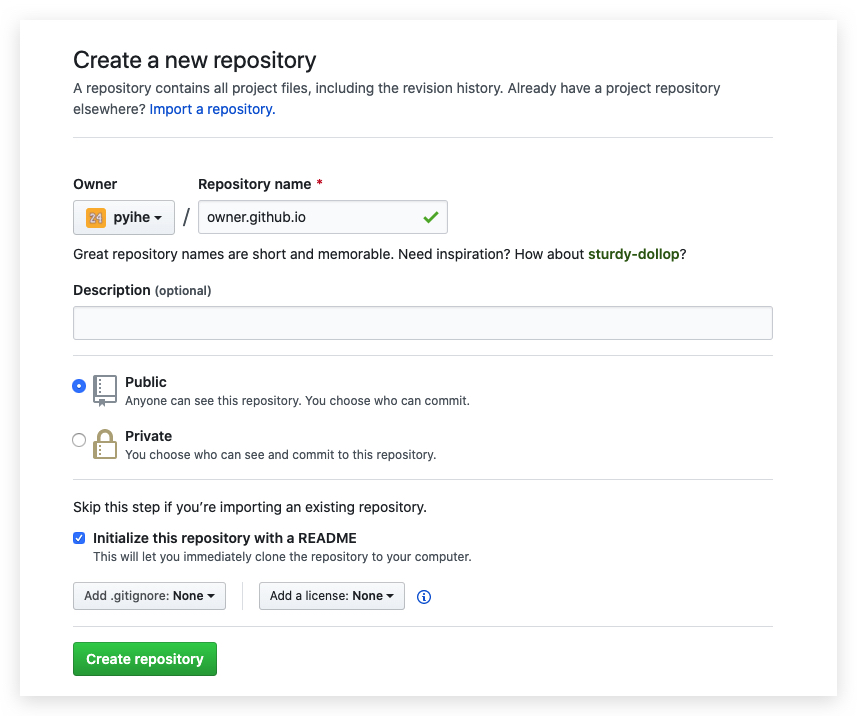
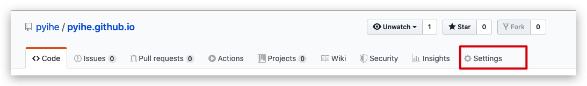
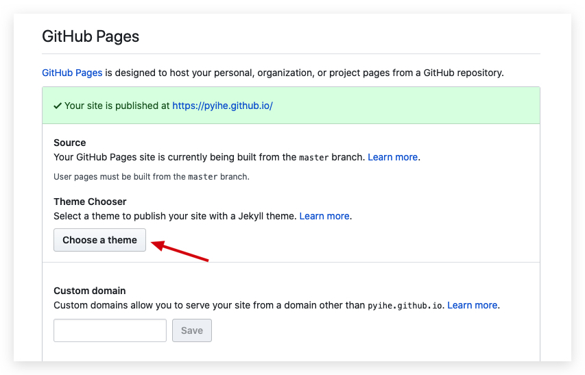

### 创建用于个人站点的repository

**Repository name请填写前方的owner(即Github用户名), 如果直接填写github.io, 最终生成的域名格式为: https://pyihe.github.io/github.io/ 而不是: https://pyihe.github.io/** 

###选择主题

**如果购买了域名, 选择主题按钮下方可以自定义GitHub Pages的域名** 
Jekyll官方有很多主题, 可自行选择 
此时进入主页https://pyihe.github.io/,便可查看Github Pages内容, 或者对README.md进行编辑显示自己的内容 

###将repo clone到本地进行编辑
控制台中执行下面的命令
>git clone git@github.com:pyihe/pyihe.github.io.git
>cd pyihe.github.io
>echo "Hello World" > index.html
>git add --all
>git commit -m "Initial commit"
>git push -u origin master

到浏览器中看一下页面内容是否不一样了吧～ 

关于自定义内容, Google中有很多很全面的教程, 此处推荐一款自己使用的主题: [H2O](https://github.com/kaeyleo/jekyll-theme-H2O)

